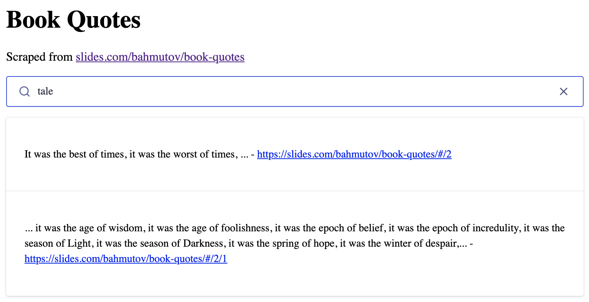

# scrape-book-quotes
> Scraping Slides.com presentation using Cypress and sending records to Algolia

To scrape the default `baseUrl` deck from [cypress.json](./cypress.json), open Cypress and click on the [spec](./cypress/integration/spec.js) file.

```shell
$ npm install
$ npx cypress open
```

The scraped records and records formatted for Algolia are saved in the [scraped](./scraped) folder.

## Send to Algolia

To send the scraped records to Algolia, need to run Cypress with environment variables `APPLICATION_ID` and `ADMIN_API_KEY`. Tip: use [as-a](https://github.com/bahmutov/as-a) for this.

```shell
$ APPLICATION_ID=... ADMIN_API_KEY=... npx cypress open
```

The scraped records will be uploaded to the "quotes" index, see [the plugins file](./cypress/plugins/index.js).

## Scrape any deck

Change the `baseUrl` to any Reveal.js deck using `CYPRESS_baseUrl` environment variable, or using `--config baseUrl=...` parameter.

```shell
$ APPLICATION_ID=... ADMIN_API_KEY=... CYPRESS_baseUrl=https://slides.com/bahmutov/... \
  npx cypress run --spec cypress/integration/spec.js
# or
$ APPLICATION_ID=... ADMIN_API_KEY=...  \
  npx cypress run --spec cypress/integration/spec.js \
    --config baseUrl=https://slides.com/bahmutov/...
```

## Check results

Open the [index.html](index.html) in a local browser and search.



## More info

- browsing every slide in the presentation using Cypress.io [video](https://youtu.be/oq2P1wtIZYY)
